#**Traffic Sign Recognition** 

## Rubric Points

Here is a link to my [project code](https://github.com/liz-murphy/CarND-Traffic-Sign-Classifier-Project/blob/master/Traffic_Sign_Classifier.ipynb)

###Data Set Summary & Exploration

#### 1. Provide a basic summary of the data set. In the code, the analysis should be done using python, numpy and/or pandas methods rather than hardcoding results manually.

I used the pandas library to calculate summary statistics of the traffic
signs data set:

* The size of training set is 34799
* The size of the validation set is 4410
* The size of test set is ?
* The shape of a traffic sign image is (32,32,3)
* The number of unique classes/labels in the data set is 43

#### 2. Include an exploratory visualization of the dataset.
    Class 0: Speed limit (20km/h), 180 samples

    Class 1: Speed limit (30km/h), 1980 samples

    Class 2: Speed limit (50km/h), 2010 samples

    Class 3: Speed limit (60km/h), 1260 samples

    Class 4: Speed limit (70km/h), 1770 samples

    Class 5: Speed limit (80km/h), 1650 samples

    Class 6: End of speed limit (80km/h), 360 samples

    Class 7: Speed limit (100km/h), 1290 samples

    Class 8: Speed limit (120km/h), 1260 samples

    Class 9: No passing, 1320 samples

    Class 10: No passing for vehicles over 3.5 metric tons, 1800 samples

    Class 11: Right-of-way at the next intersection, 1170 samples

    Class 12: Priority road, 1890 samples

    Class 13: Yield, 1920 samples

    Class 14: Stop, 690 samples

    Class 15: No vehicles, 540 samples

    Class 16: Vehicles over 3.5 metric tons prohibited, 360 samples

    Class 17: No entry, 990 samples

    Class 18: General caution, 1080 samples

    Class 19: Dangerous curve to the left, 180 samples

    Class 20: Dangerous curve to the right, 300 samples

    Class 21: Double curve, 270 samples

    Class 22: Bumpy road, 330 samples

    Class 23: Slippery road, 450 samples

    Class 24: Road narrows on the right, 240 samples

    Class 25: Road work, 1350 samples

    Class 26: Traffic signals, 540 samples

    Class 27: Pedestrians, 210 samples

    Class 28: Children crossing, 480 samples

    Class 29: Bicycles crossing, 240 samples

    Class 30: Beware of ice/snow, 390 samples

    Class 31: Wild animals crossing, 690 samples

    Class 32: End of all speed and passing limits, 210 samples

    Class 33: Turn right ahead, 599 samples

    Class 34: Turn left ahead, 360 samples

    Class 35: Ahead only, 1080 samples

    Class 36: Go straight or right, 330 samples

    Class 37: Go straight or left, 180 samples

    Class 38: Keep right, 1860 samples

    Class 39: Keep left, 270 samples

    Class 40: Roundabout mandatory, 300 samples

    Class 41: End of no passing, 210 samples

    Class 42: End of no passing by vehicles over 3.5 metric tons, 210 samples

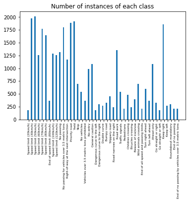

### Design and Test a Model Architecture

#### 1. Describe how you preprocessed the image data. What techniques were chosen and why did you choose these techniques? 

- I converted the images to grayscale
- I used histogram normalization on the images, as many of the images in the visualization have poor contrast and are very dark. Histogram normalization was used in this [basline paper](http://yann.lecun.com/exdb/publis/pdf/sermanet-ijcnn-11.pdf).

Here are some examples of original images and their preprocessed counterparts:
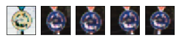

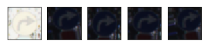

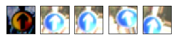

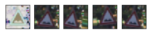

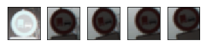

- I augmented the data, but chose to keep the balance of classes as is, because I assumed it reflected the balance of classes in the test set/real world. This assumption would be something to experiment with in future.
The data augmentation was done by performing a random affine transformation and warp, with scaling between 90 - 110% of the original scale, a rotation between +/- 15 degrees, and a transformation of +/- 2 pixels.

Here is an example of some original images (1st of the row) and their augmentations:
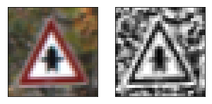

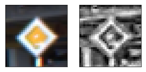

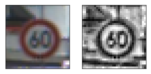

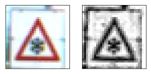

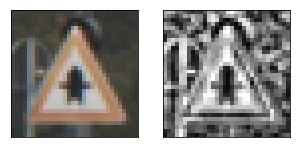

#### 2. Describe what your final model architecture looks like including model type, layers, layer sizes, connectivity, etc.) Consider including a diagram and/or table describing the final model.

My final model came out of experimenting with the LeNet lab architecture, and experimenting with some ideas from a published [baseline on this dataset] (http://yann.lecun.com/exdb/publis/pdf/sermanet-ijcnn-11.pdf).

This is a diagram of the final architecture.

Things to note:
- As per [baseline](http://yann.lecun.com/exdb/publis/pdf/sermanet-ijcnn-11.pdf) I used grayscale images as inputs.
- I used 2 convolutional layers.
- Initial experiments with the LeNet architecture showed better results with more output layers on each of the convolutional layers. I used 32 outputs at the first layer and 64 at the second.
- Unlike the LeNet lab, I used features from the first convolutional layer (with additional pooling) as well as the second as inputs to the fully connected layer. This improved performance.

#### 3. Describe how you trained your model. The discussion can include the type of optimizer, the batch size, number of epochs and any hyperparameters such as learning rate.

- I kept most of the LeNet lab parameters unchanged.
- The learning rate was set to 0.001 and batch size to 128.
- I increased the number of epochs to 30 - but didn't see much change after 15-20.
- As in the LeNet lab I used the AdamOptimizer for optimization of the gradient descent problem.
- I used Xavier initialization instead of truncated normal distributions for the weights to cut down number of parameters.

#### 4. Describe the approach taken for finding a solution and getting the validation set accuracy to be at least 0.93. 

I used an iterative approach to change the model.
- I began with the LeNet model from the lab solution, it had a validation set accuracy of around 0.87.
- I started by preprocessing the data, and found a large performance bump from histogram normalization and using grayscale images, this took validation set accuracy to the region of 0.91.
- I added more outputs to the convolutional layers, this took the accuracy on the validation step to around 0.93
- I experimented with dropout on the fully connected layers, and implemented image augmentation to have more training data.
- Finally I forwarded the first convolutional layer outputs to the fully connected layer via some additional max pooling.

My final model results were:
* validation set accuracy of 0.984 
* test set accuracy of 0.968

The relatively narrow difference between validation and test set accuracy shows the model is working well.
 

###Test a Model on New Images

####1. Choose five German traffic signs found on the web and provide them in the report. For each image, discuss what quality or qualities might be difficult to classify.

Here are five German traffic signs that I found on the web:

    

#### 2. Discuss the model's predictions on these new traffic signs and compare the results to predicting on the test set. At a minimum, discuss what the predictions were, the accuracy on these new predictions, and compare the accuracy to the accuracy on the test set.

Here are the results of the prediction:

| Image			                                |     Prediction	        					| 
|:---------------------------------------------:|:---------------------------------------------:| 
| Speed limit 100km/h                           | Speed limit 20km/h 							| 
| Ahead Only  		                        	| Ahead Only									|
| Right of Way at next intersection				| Slippery Road									|
| Priority Road	      		                    | Priority Road					 				|
| Roundabout			                        | Roundabout         							|

The model was able to correctly guess 3 of the 5 traffic signs, which gives an accuracy of 60%. This is poor compared to the test set accuracy of 96.8%. However, if you dig into the softmax probabilities the performance seems a little better ...

The wrong predictions included the speed limit sign, which has a deformed top right corner. This may have contributed to the poor performance. As you can see in the graphs below, all top predictions were for speed limit signs, just not the right one.

It also got the "Right of way at the next intersection" prediction wrong, mistaking it for a "Slippery Road". These are both black graphics inside a red bordered triangle - so have similar gross features. In this case, the correct class was actually the 2nd highest of the softmax probabilities.

#### 3. Describe how certain the model is when predicting on each of the five new images by looking at the softmax probabilities for each prediction. Provide the top 5 softmax probabilities for each image along with the sign type of each probability. 

The graphs below show the top 5 softmax probablities for each of the 5 signs.
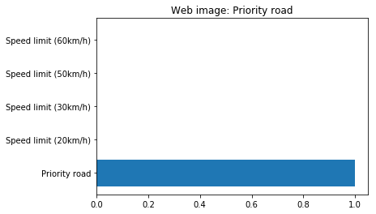

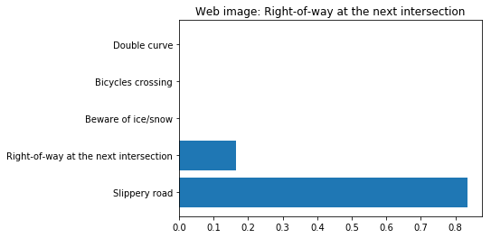

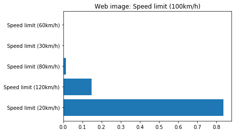

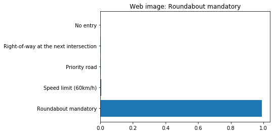

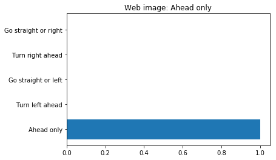
